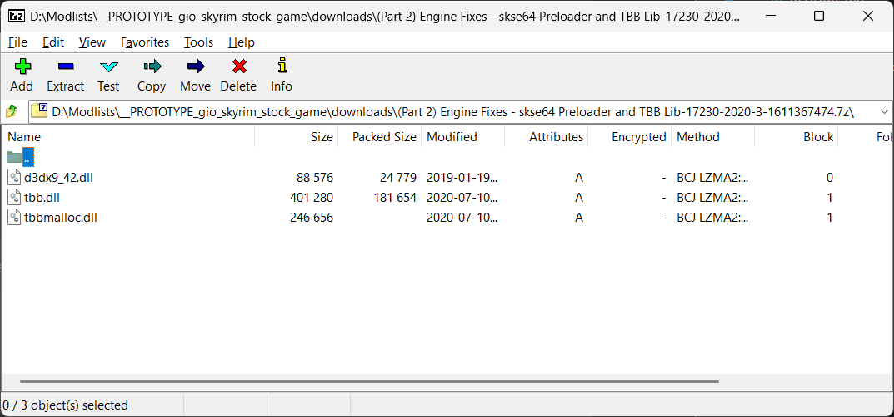

# Engine Fixes

```project_info
homepage: https://www.nexusmods.com/skyrimspecialedition/mods/17230
about: skse64 plugin to fix various issues with the Skyrim Special Edition engine
requirements:
- Skyrim Script Extender (SKSE64)
- Address Library for SKSE Plugins
downloads:
- (Part 1) SSE Engine Fixes for 1.6.1170 and newer
- (Part 2) Engine Fixes - skse64 Preloader and TBB Lib **(manual download)**
```

!!! tip
    Includes fix for **Steam achievements** when running *Skyrim* from *MO2*.

## Part 1

* double-click it in *Downloads* tab from *MO2* and install it like any other mod
* name it `SSE Engine Fixes (skse64 plugin)` (the default)

## Part 2

!!! note
    Like with the *skse* binaries, *Part 2* contains only three files, so it is easy to track them manually.

* select the download in the *Downloads* tab from *MO2*
* right-click it and select the `Query Info` context menu to automatically fetch the info and create
  a `.meta` file for the download
* right-click it again and select the `Open File` context menu to open the file in your *archive manager*
* select all the files and drag-and-drop in the `stock_game` folder
  * `d3dx9_42.dll`
  * `tbb.dll`
  * `tbbmalloc.dll`




