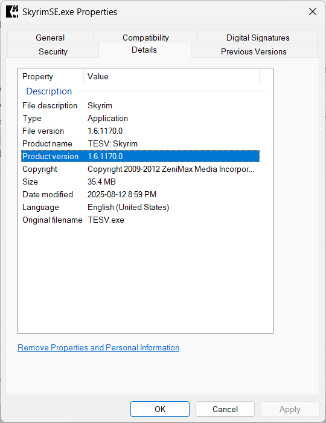

# General Notes

## Basic Tools

We assume a couple of tools already exists on your system:

* `git`
* `make`
* `imagemagick` (for making the `favicon.ico`)
* `cwebp` (for making the `cover.webp`)
* `python`
* `uv` (for managing `Python` projects)
* `cfv` (for making checksum files)

I use [chocolatey](https://community.chocolatey.org/), [scoop](https://scoop.sh/) and `pipx` to install and
manage these applications:

```bash
choco install git imagemagick make
```

```bash
scoop install libwebp python pipx uv
```

```bash
pipx install cfv
```

## Cloning this project

This project is meant to be used as a placeholder for the actual Wabbajack compilation,
though most of the files that go into the compilation are ignored, and not store in the git
repository. Only these files are stored:

* the documentation files (mostly in the `docs/` folder)
* the meta files for the downloads (in the `mo2/downloads` folder)
* the *MO2* profiles (in the `mo2/profiles` folder)
* the compile settings (in the `Gio's Skyrim.compiler_settings` file)

If you want to reuse the project, clone it and follow the steps in this docs for populating
the *MO2* and your compilation:

```bash
git clone https://github.com/gio-gianny/gio_skyrim_stock_game GioSkyrim
```

???+ tip "(Optional) Configure some local git credentials"

    ```bash
    cd GioSkyrim
    ```

    ```bash
    git config user.name ***
    ```

    ```bash
    git config user.email ***@***
    ```

## Makefile jobs

A couple of helper `make` jobs are defined in the top `Makefile`.

### VSCode

If you are using *VSCode*, some of the `make` helper hobs can be run via the *Task Runner*.

## Project images

### cover.webp

Wabbajack compilations require the image in `.webp` format. We use `cwebp` to convert a source
`.png` to `.webp`.

```bash
cwebp -q 80 docs/images/cover.png -o docs/images/cover.webp
```

??? tip "Changing or regenerating the cover"
    You can regenerate or changed the cover by:

    * overwriting the `docs/images/cover.png` image with another `.png` image
    * call directly `cwebp` or use `make`:

        ```bash
        make cover
        ```

### favicon.ico

The docs `favicon.ico` is located in `docs/images/favicon.ico` and is generated with `imagemagick` from
the `docs/images/favicon.svg`. Use `make` to regenerate or change the favicon:

??? tip "Changing or regenerating the favicon"
    You can regenerate or changed the cover by:

    * overwriting the `docs/images/favicon.svg` image with another `.svg` image
    * use `make`:

        ```bash
        make favicon
        ```

## Viewing the docs locally

Documentation is created with [mkdocs](https://www.mkdocs.org/) and [mkdocs-material](https://squidfunk.github.io/mkdocs-material/).

You can view the documentation locally, on <http://127.0.0.1:8000> by installing the required packages
and then run `mkdocs serve`:

```bash
uv sync
```

```bash
make docs_serve
```

## Mod Organizer 2 tree snapshots

The `mo2_tree_snapshot` job uses `cfv` to generate a *checksum file* with all the files
under the `mo2` folder. These files can be used to check if and what changes when running
some tool or application.

```bash
make mo2_tree_snapshot
```

In *VSCode*, the job can be run from the *Task Runner*.

Process:

* create a snapshot before running the application or command
* run the application
* after quitting the application, create a new snapshot
* select both snapshots and compare them with *VSCode* or another diff tool

## Skyrim location

The documentation assume we're moding *Skyrim Special Edition* from *Steam*, on *Windows*, installed
on disk `D:\` in:

```cmd
D:\SteamLibrary\steamapps\common\Skyrim Special Edition
```

## Finding your Skyrim version

Many mods require a specific *Skyrim* version, so you should always know what your version is.

* find the `Skyrim.exe` you are using

    ```cmd
    D:\SteamLibrary\steamapps\common\Skyrim Special Edition
    ```

* right-click it and select `Properties`
* go to the `Details` page
* check the `Product version` value

For example, the `Skyrim.exe` version in the image bellow is `1.6.1170.0`.


