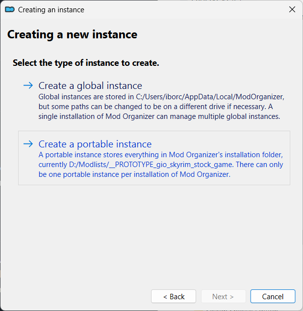
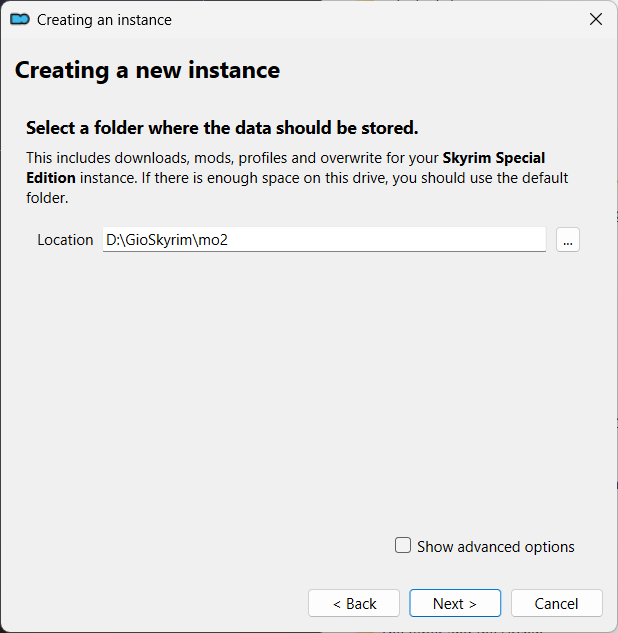
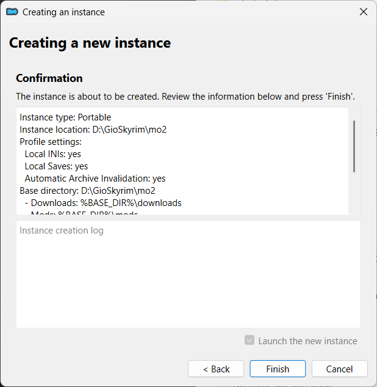

# Portable MO2 instance setup

!!! warning

    These steps must be done after [copying game files](mo2_setup_stock_game.md) to the `stock_game`.

!!! note

    The `Creating a new instance` wizard will be shown the first time you are running `MO2`.

## What is an instance?

Click `Next >`.


## Select the type of instance to create

Click `-> Create a portable instance`.



## Select the game to manage

Click `-> Browse` and then select the `stock_game` folder.


??? tip "Check path was correctly set"

    From the `Select the game edition` page, click the `< Back` button to verify that the
    correct path was selected.

    

    Now click `Next >` to return to the `Select the game edition` page.

## Select the game edition

Click `-> Steam`.


## Configure your profile settings

Check all the checkboxes

* [x] Use profile-specific game INI files
* [x] Use profile-specific save games
* [x] Automatic archive invalidation

Click `Next >`.


## Select a folder where the data should be stored

??? info "Advanced options"

    By default, the `Location` is set to the folder that contains the `ModOrganizer.exe` executable.

    Checking `Show advanced options` allows you to tweak the locations of `downloads`,
    `mods`, `profiles` and `overwrite`.

    Leave everything at their defaults.

    

Click `Next >`.



## Confirmation

Click `Finish`.



## Show tutorial?

Click `No`.


## Category Setup

Click `Import Nexus Categories`.


## Done

The *MO2* portable setup is now ready.


!!! tip "Tree snapshot"

    Make a [tree snapshot](tree_snapshots.md) and check what has changed.

??? tip "Inspect what changed"

    You can use `diff`, `grep` and `cut` to get the list of changed files:

    ```bash
    diff -u0 --ignore-all-space '....sha1' '....sha1' | grep -v '@@' | grep -v '^---' | grep -v '^+++' | cut -b1,44- -
    ```
    ```
    +ModOrganizer.ini
    +categories.dat
    +logs\mo_interface.log
    +logs\usvfs-2025-08-19_16-48-37.log
    +nexuscatmap.dat
    +profiles\Default\archives.txt
    +profiles\Default\initweaks.ini
    +profiles\Default\loadorder.txt
    +profiles\Default\lockedorder.txt
    +profiles\Default\modlist.txt
    +profiles\Default\plugins.txt
    +profiles\Default\settings.ini
    +profiles\Default\skyrim.ini
    +profiles\Default\skyrimcustom.ini
    +profiles\Default\skyrimprefs.ini
    +webcache\data8\9\-1sducl9.d
    +webcache\nexus_cookies.dat
    ```
