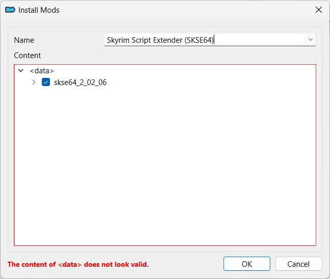
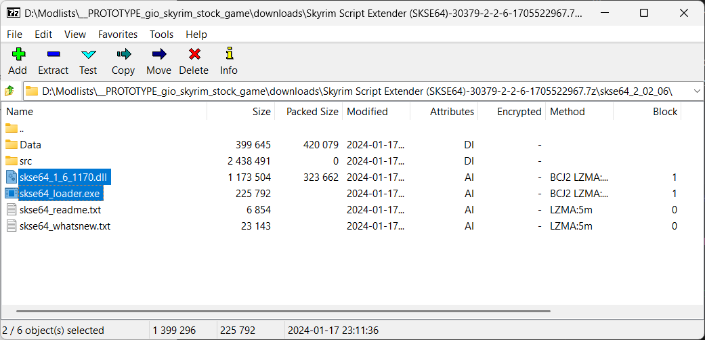
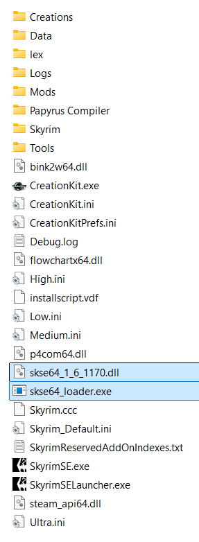
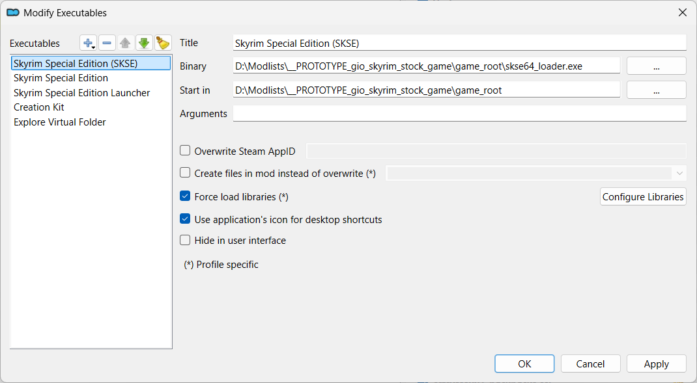
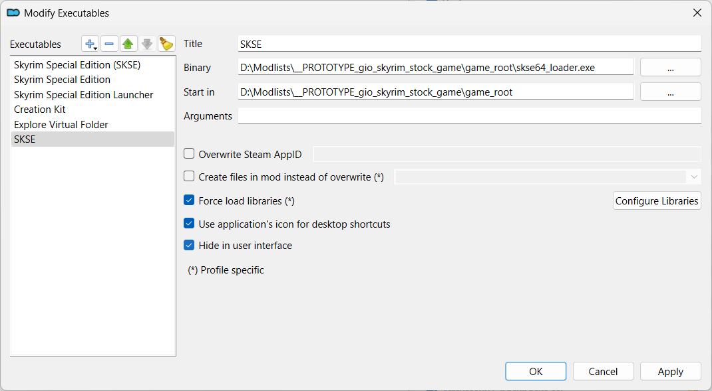
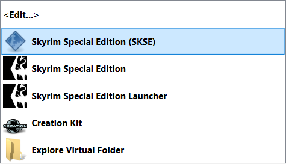
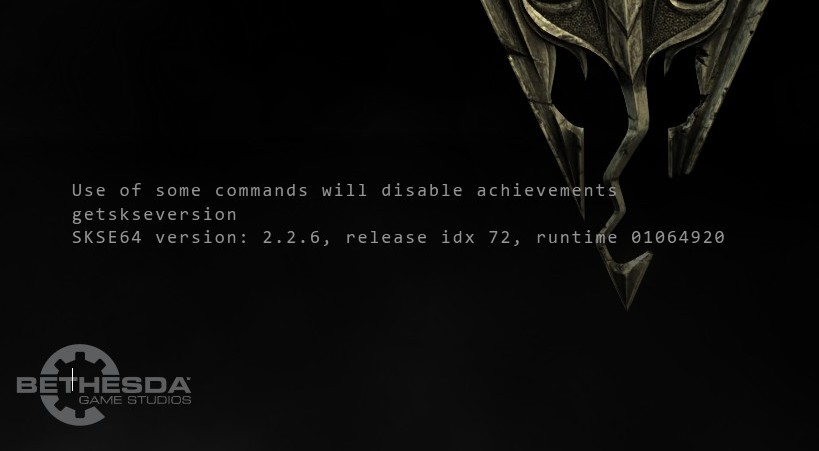

# Skyrim Script Extender (SKSE64)

```nexus
homepage: https://www.nexusmods.com/skyrimspecialedition/mods/30379
about: tool used by many Skyrim mods that expands scripting capabilities and adds additional functionality to the game
```

## References

* [Setting up Stock Game for Skyrim SE - by Althro](https://github.com/LivelyDismay/Learn-To-Mod/blob/main/lessons/Setting%20up%20Stock%20Game%20for%20Skyrim%20SE.md#skse)
* [Skyrim Initial Setup (SSE and AE)](https://www.nexusmods.com/skyrimspecialedition/articles/6528)

## Download

Download the latest `skse` package for your *Skyrim version* from
[Nexus](https://www.nexusmods.com/skyrimspecialedition/mods/30379) with *MO2*.

## Install scripts

!!! note
    We are installing the `Scripts` from *skse* as a module for easier update in the future.

In *Mod Organizer 2*:

* double-click the *skse* archive in the *Downloads* tab to install
* you will be informed that `The content of <data> does not look valid.`
* if the tutorial pops up, feel free to read through this if this is your first time or
  just exit by clicking the `Exit Tutorial` box



* expand the `skse64_x_x_x` item and right-click the `Data` folder
* select the `Set as <data> directory` menu


* after selecting the `Set as <data> directory` menu, the `Content` should look like bellow
* the dialog should show `The content of <data> looks valid.`
* click the `OK` button
* enable the new mod


## Install binaries

!!! note
    There is only one `.exe` and one `.dll`, so it is OK to install them by hand.

* the `.exe` and the `.dll` must be copied by hand in the `game_root` folder
* double-click the *skse* archive to open it with your *archive manager* (for example, [7-zip](https://www.7-zip.org/))
* select the `.exe` and the `.dll`
* drag-and-drop in the `game_root` folder





## Game launcher

!!! tip
    *Mod Organizer 2* automatically creates an `SKSE` launcher when started, if such a
    launcher is not present and *MO2* finds the `skse64_loader.exe` in the game folder.

    However, if an `SKSE` launcher is found, it is not updated, so any changes done to it,
    like making it hidden, are preserved.

* if the `SKSE` launcher is not present, restart *MO2*
* rename the `SKSE` launcher however you like and move it at the top
* add it to the tool bar by clicking the `Shortcut` button and selecting `Toolbar and Menu`



* restart *MO2*
* a new `SKSE` launcher will be created automatically
* select it and check the `Hide in user interface`





## Verify the install

* launch the game using the new launcher
* in the console, type `getskseversion`
* if *skse* is correctly installed, it should show your actual version



## Upgrading

If you need to upgrade the *skse* in the future:

* uninstall the mod with the scripts
* install the new scripts as a mod
* overwrite the old binaries with the new ones
