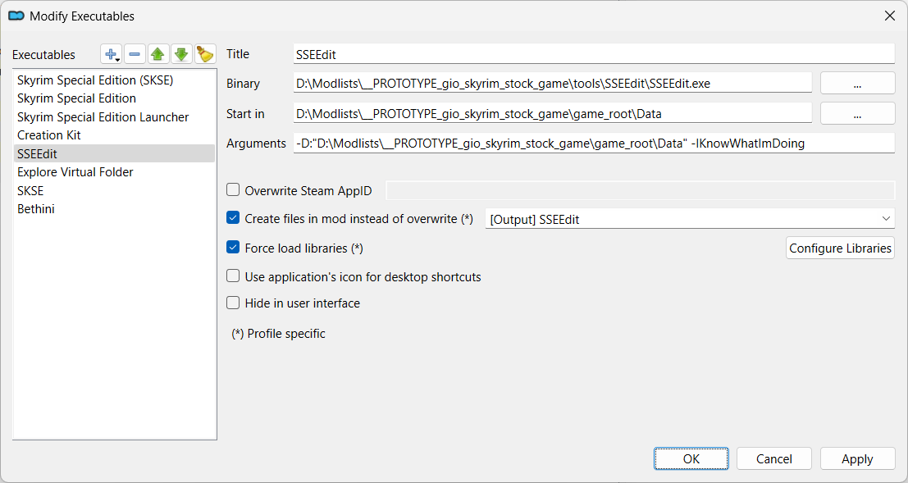

# xEdit

!!! note
    [xEdit](https://github.com/TES5Edit/TES5Edit) provides both *SSEEdit* and *SSELODGen*.

## References

* [Althro's Dev Tools (ADT)](https://github.com/Styyx1/ADT)
* [Skyrim Modding Essentials - A Wabbajack List](https://www.nexusmods.com/skyrimspecialedition/mods/71689)
* [Tome of xEdit](https://tes5edit.github.io/docs/)

## SSEEdit

```project_info
homepage: https://www.nexusmods.com/skyrimspecialedition/mods/164
about: "Skyrim: Special Edition version of xEdit"
requirements:
- "[7-Zip](https://www.7-zip.org/)"
downloads:
- SSEEdit 4.1.5f **(manual download)**
```

* right-click and select `Open Meta File`

    Use the download URL to determine the `modID` and `fileID`.

    ```ini
    [General]
    installed=true
    gameName=SkyrimSE
    modID=164
    fileID=495506
    removed=true
    ```

* right-click and select `Open File`
* copy the content to the `tools` folder
* rename the folder to `tools\SSEEdit`
* create a launcher

### SSEEdit launcher

```mo2_launcher
title: SSEEdit
binary: "&lt;SOURCE_DIR&gt;\\tools\\SSEEdit\\SSEEdit.exe"
start_in: "&lt;SOURCE_DIR&gt;\\game_root\\Data"
arguments: '-D:"&lt;SOURCE_DIR&gt;\\game_root\\Data" -IKnowWhatImDoing'
overwrite_mod: "[Output] SSEEdit"
force_load_libraries: true
```



## SSELODGen

```project_info
homepage: https://www.nexusmods.com/skyrimspecialedition/mods/6642
about: An almost one-click LOD generator for Skyrim Special Edition
downloads:
- SSELODGen 3.2.1 **(manual download)**
```

* right-click and select `Open Meta File`

    Use the download URL to determine the `modID` and `fileID`.

    ```ini
    [General]
    installed=true
    gameName=SkyrimSE
    modID=6642
    fileID=51884
    removed=true
    ```

* make `tools\SSELODGen` folder
* right-click and select `Open File`
* copy the contents to the `tools\SSELODGen` folder
* create a launcher

### SSELODGen launcher

```mo2_launcher
title: SSELODGen
binary: "&lt;SOURCE_DIR&gt;\\tools\\SSELODGen\\SSELODGen.exe"
arguments: '-sse -O:"&lt;SOURCE_DIR&gt;\\tools\\SSELODGen\Output" -D:"<SOURCE_DIR>\\game_root\\Data"'
force_load_libraries: true
```


