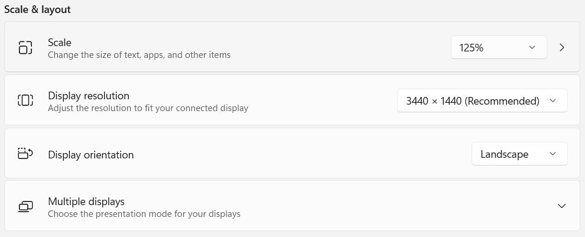
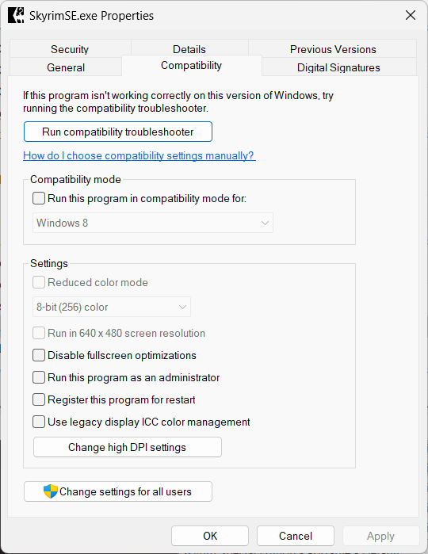
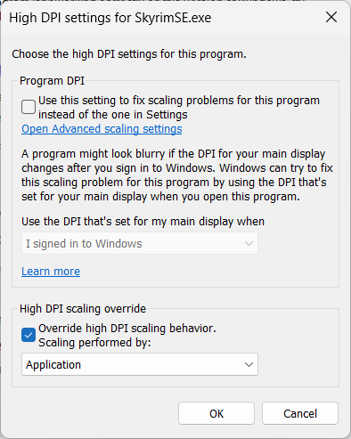

---
tags:
    - screen
---

# Skyrim

## Skyrim edition and location

The project assumes we're moding the **Steam** version **Skyrim Anniversary Edition**, on
*Windows*, installed on disk `D:\` in:

```cmd
D:\SteamLibrary\steamapps\common\Skyrim Special Edition
```

## Finding your Skyrim version

Many mods are *Skyrim* version specific, so you should always know what your version is:

* find the `Skyrim.exe` you are using

    ```cmd
    D:\SteamLibrary\steamapps\common\Skyrim Special Edition
    ```

* right-click it in *File Explorer* and select `Properties`
* go to the `Details` page
* check the `Product version` value

For example, the `Skyrim.exe` version in the image bellow is `1.6.1170.0`.


## Fixing Windows 11 scaling

If you've configured your *Windows* to use a scale different than `100%`, your
*Skyrim* window might get bigger compared with what's in your game setup.



You can try these steps to fix this:

* find the `Skyrim.exe` you are using

    ```cmd
    <SOURCE_DIR>\mo2\stock_game\
    ```

    !!! warning "Configure the proper Skyrim.exe"

        You must setup the `High DPI Setting` for the actual `Skyrim.exe` you are
        going to run. This Wabbajack compilation uses the game_stock configuration,
        so you must change the `Skyrim.exe` copy from `<SOURCE_DIR>\mo2\stock_game\`.

* right-click it in *File Explorer* and select `Properties`
* go to the `Compatibility` page

    

* click the the `Change high DPI settings`
* in the `High DPI settings` dialog:
    * check the `Override high DPI scaling behaviour`
    * select `Application` in the `Scaling performed by:` drop-down box
    * click `OK` to close the dialog

    

* click `OK` to close the `Properties` dialog
