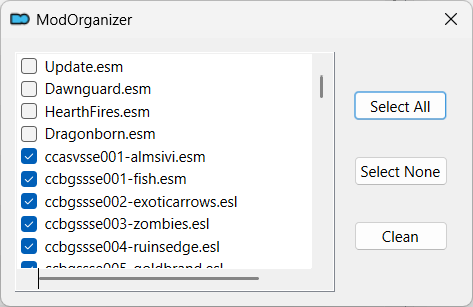
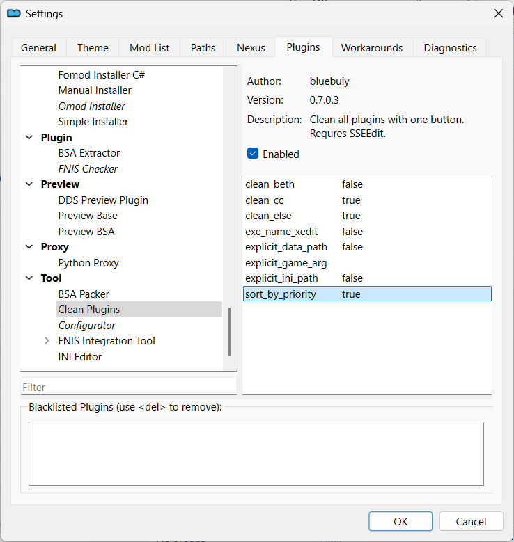

---
tags:
    - mo2
    - mo2 plugin
    - xedit
---

# Batch Plugin Cleaner

```project_info
homepage: https://www.nexusmods.com/skyrimspecialedition/mods/59598
about: Automatically run sseedit quick clean on a set of plugins.
requirements:
    - Mod Organizer 2
    - xEdit / SSEEdit
```

!!! warning

    The plugin will work only after installing and configuring [xEdit](../tools/xedit.md).

## Install

* download the archived plugin from Nexus using MO2
* extract the archived plugin
* move the `BatchPluginCleaner.py` to `mo2/plugins/`
* restart *MO2*

## Clean plugins

* start the plugin by selecting `MO2 Menu > Tools > Tool Plugins > Clean Plugins`
* check the plugins you want to clean
* click `Clean`



### Interrupt cleaning

Unlock MO2 while cleaning is in progress *stops cleaning*.

## Plugin list sorting

Sorting is controlled by the `sort_by_priority` value in the *plugin settings*.

| sorting | sort_by_priority |
|---|---|
| priority | true (default) |
| alphabetically | false |


