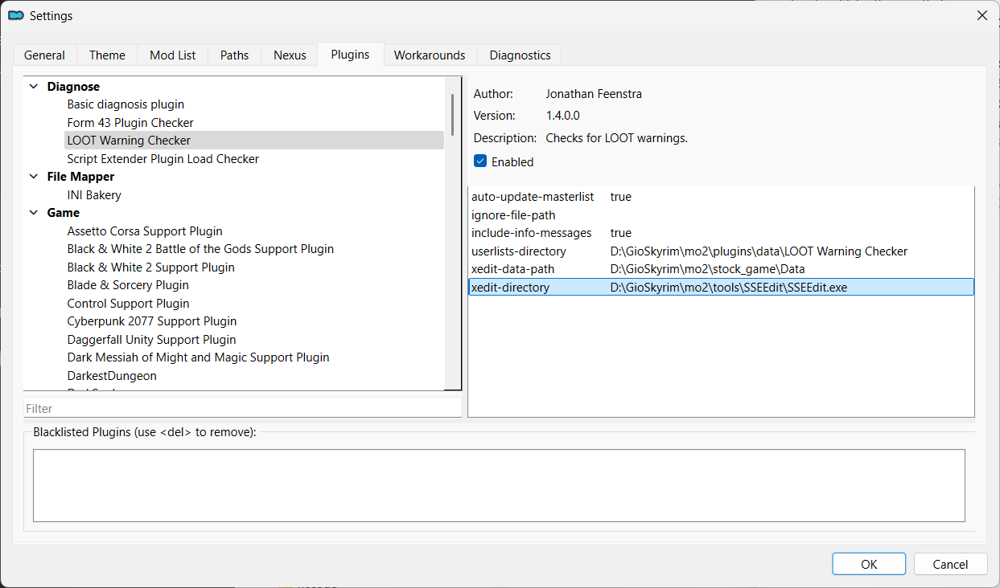
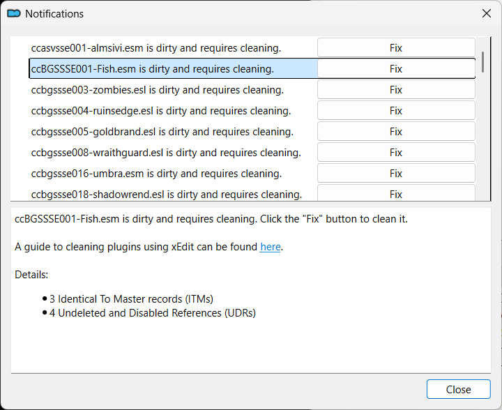
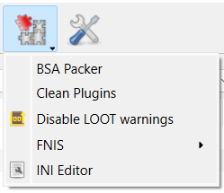
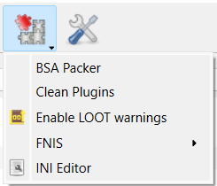

---
tags:
    - mo2
    - mo2 plugin
    - xedit
---

# LOOT Warning Checker

```project_info
homepage: https://www.nexusmods.com/site/mods/323
about: Check for LOOT warnings and display them as notifications, without needing to sort the load order. Features a guided fix to clean dirty plugins using xEdit.
requirements:
    - Mod Organizer 2
    - xEdit / SSEEdit
```

!!! warning

    The plugin will work only after installing and configuring [xEdit](../tools/xedit.md).

## Installation

* extract the `LOOT-Warning-Checker` folder to `mo2\plugins` folder
* remove the contents of the existing folder before updating to a newer version

## Setup

* activate the `MO2 Menu > Tools > Settings...` menu
* go to the `Plugins` tab
* select the `LOOT Warning Checker`
* verify that `xedit-data-path` and `xedit-directory` are correctly set



## Usage

* open the *Warnings* dialog
* select a mod to see its problems
* click on the `Fix` button to fix a particular mod



## Disable warnings



## Enable warnings


