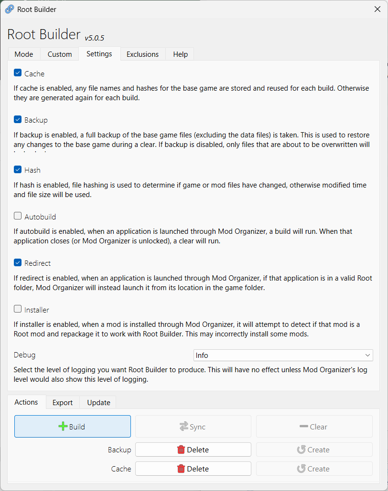
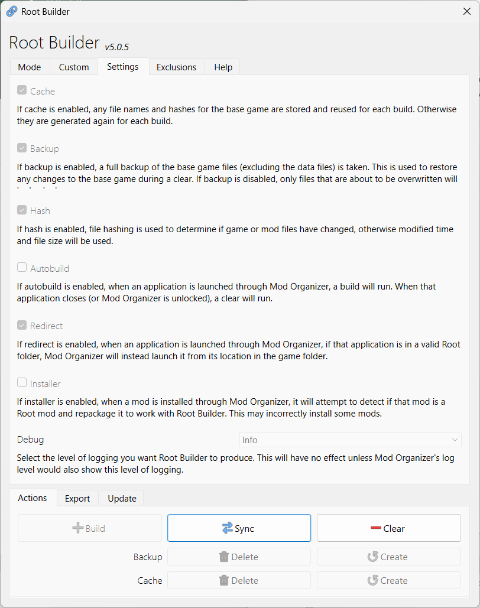

---
tags:
    - mo2
    - mo2 plugin
    - root builder
---

# Root Builder

*Kezyma's Root Builder*

```project_info
homepage:
    - https://www.nexusmods.com/skyrimspecialedition/mods/31720
urls:
    - "[GitHub Releases](https://github.com/Kezyma/ModOrganizer-Plugins/releases/tag/rootbuilder)"
    - "[GitHub Docs](https://kezyma.github.io/?p=rootbuilder)"
about: Allows you to manage files in the base game folder through Mod Organizer, leaving your game folder in pristine, vanilla condition!
requirements:
    - Mod Organizer 2
```

!!! tip "Check what changes during activation"

    Use the [tree snampshots](../general_notes/tree_snapshots.md) to check
    what files are copied during the mod activation.

## Installation

* extract the `rootbuilder` folder to `mo2\plugins` folder
* remove the contents of the existing folder before updating to a newer version

## Manual build and clear

By default, the `root_builder` uses `Autobild` that copies any file in `root` folder of a
mod to the `\\mo2\\stock_game` folder when launching an application through *MO2*. The
files are deleted when the application exits.

To avoid all this copy & delete, you can:

* uncheck the `Autobuild`
* click the `Build` button to copy the files to the stock game folder

    

* click the `Clear` when you need to remove them

    

!!! tip

    You are entirely responsible for building and clearing the root files, if you disable
    the `Autobild`.

    Some simple rules of thumb:

    * *clear* before installing new root mod
    * *build* after that or just before launching an app
    * you don't need to *clear* and *build* as long as you don't install new *root* mods
