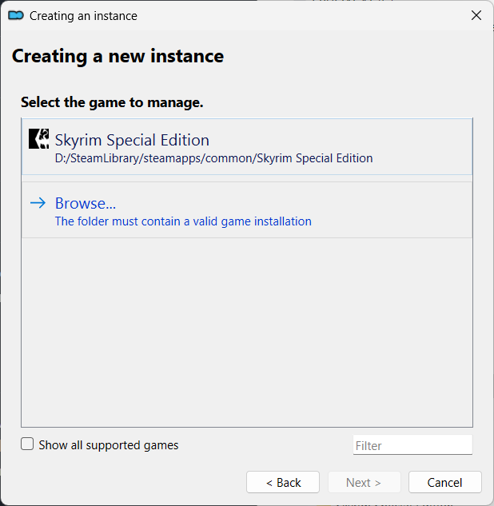
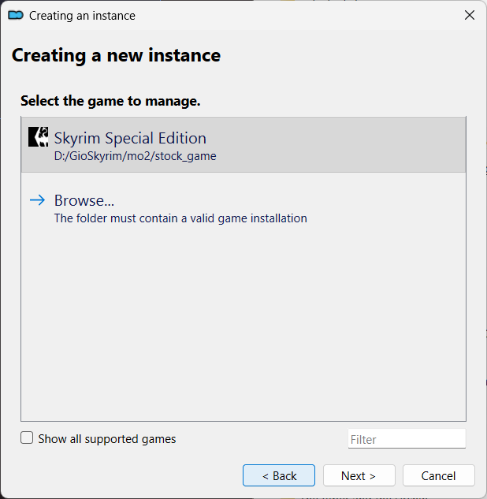
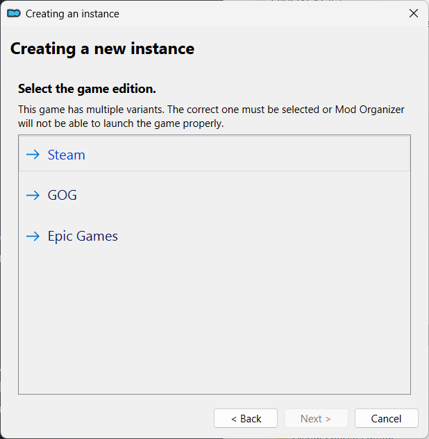
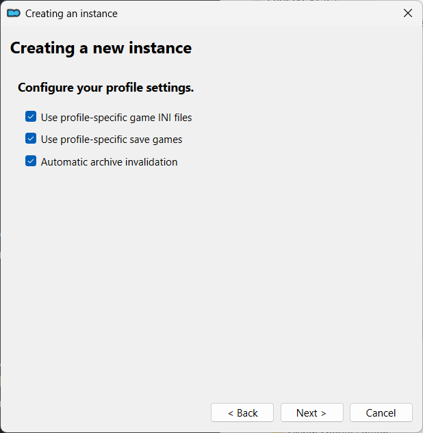
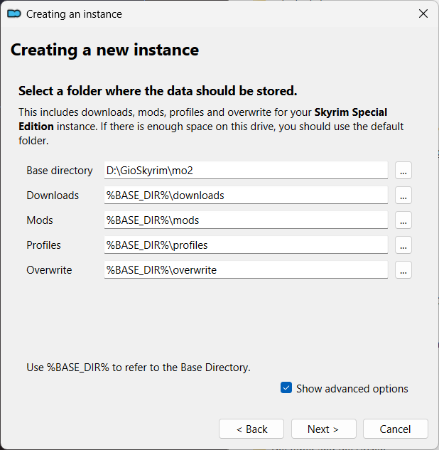
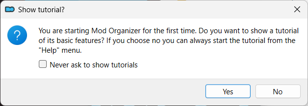

# Portable MO2 Instance Setup

> [!WARNING]
> These steps must be done after copying files to the `game_root` as described [here](game_root.md).

> [!NOTE]
> The `Creating a new instance` wizard will be shown the first time you are running `MO2`.

## What is an instance?

Click `Next >`.

## Select the type of instance to create

Click `-> Create a portable instance`.

## Select the game to manage

Click `-> Browse` and then select the `game_root` folder.

## Select the game edition

Click `-> Steam`.

## Configure your profile settings

Check all the checkboxes

* [x] Use profile-specific game INI files
* [x] Use profile-specific save games
* [x] Automatic archive invalidation

Click `Next >`.

## Select a folder where the data should be stored

> [!NOTE]
> By default, the `Location` is set to the folder that contains the `ModOrganizer.exe` executable.
>
> Checking `Show advanced options` allows you to tweak the locations of `downloads`, `mods`, `profiles` and `overwrite`.
>
> Leave everything at their defaults.

Click `Next >`.

## Confirmation

Click `Finish`.

## Category Setup

Click `Do Nothing`.

## Done

