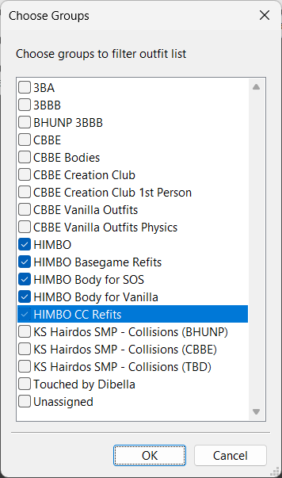
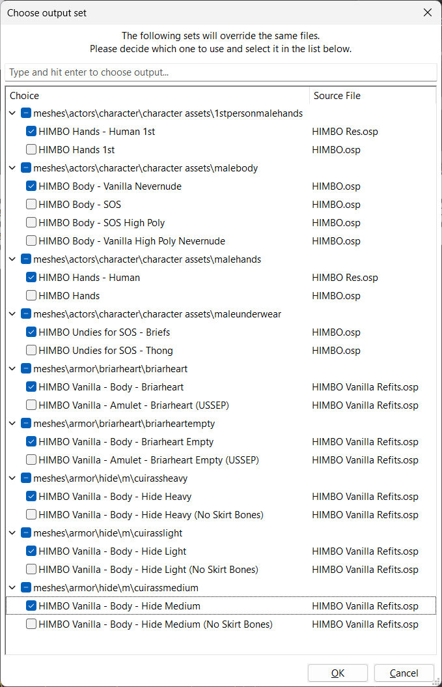

---
tags:
    - body, face, hair
    - body
    - himbo
    - male
    - nexus
---

# Highly Improved Male Body Overhaul -HIMBO-

```project_info
homepage: https://www.nexusmods.com/skyrimspecialedition/mods/46311
about:
requirements:
    - BodySlide and Outfit Studio
    - FSMP - Faster HDT-SMP
    - RaceMenu
    - The New Gentleman (NSFW, not needed if you plan to use NEVERNUDE body.)
    - XP32 Maximum Skeleton Special Extended - XPMSSE
downloads:
    - 01) HIMBO V5 - Core
    - 02a) HIMBO V5 - BG-DG-DB Refits
    - 02b) HIMBO V5 - CC Refits
    - Dragon Aspect Hotfix
```

## Common Questions

!!! question "When I try to use the sliders in-game, they don’t do anything!"

    Try rebuilding, and make sure you have ‘Build Morphs’ checked. Make sure nothing is
    overwriting the body. See if the requirements – RaceMenu and XP32 Maximum Skeleton
    Extended – are working correctly. You may need to use a different version of RaceMenu
    depending on your version of the game. To check if XP32 Maximum Skeleton Extended is
    working, verify via the in-game MCM.

## BodySlide




