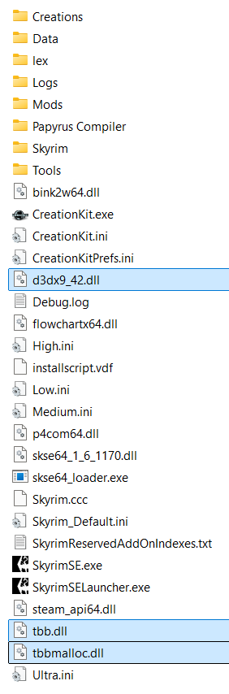

---
tags:
    - mods
    - essential
    - fixes & patches
---

# SSE Engine Fixes (skse64 plugin)

```project_info
homepage: https://www.nexusmods.com/skyrimspecialedition/mods/17230
about: skse64 plugin to fix various issues with the Skyrim Special Edition engine
requirements:
- Address Library
- Skyrim Script Extender (SKSE64)
downloads:
- (Part 1) SSE Engine Fixes for 1.6.1170 and newer
- (Part 2) Engine Fixes - skse64 Preloader and TBB Lib **(manual download)**
```

!!! tip
    Includes fix for **Steam achievements** when running *Skyrim* from *MO2*.

## Install Part 1

* double-click it in *Downloads* tab from *MO2* and install it like any other mod
* name it `(Part 1) SSE Engine Fixes for 1.6.1170 (v6.2)`

## Part 2

### Create .meta

* select the download in the *Downloads* tab from *MO2*
* right-click it and select the `Query Info` context menu to automatically fetch the info and create
  a `.meta` file for the download

### Install with root_builder

* double-click it in *Downloads* tab from *MO2* to `Install Mods` dialog
* set the name of the mod to `[Root] (Part 2) Engine Fixes - skse64 Preloader and TBB Lib`

    

* right-click the `<data>` folder, select `Create directory...`
* name the directory as `root`
* move the three `.dll` files under it

    

* click the `OK` button even though `The content of <data> does not look valid.` is still shown
* click `Ignore` when asked if you want to continue
* enable the new mod

### Install by hand

!!! note

    Like with the *skse* binaries, *Part 2* contains only three files, so it is easy to track them manually.

    You should probably still use the *root builder* method.

* right-click it again and select the `Open File` context menu to open the file in your *archive manager*
* select all the files and drag-and-drop in the `stock_game` folder
    * `d3dx9_42.dll`
    * `tbb.dll`
    * `tbbmalloc.dll`



