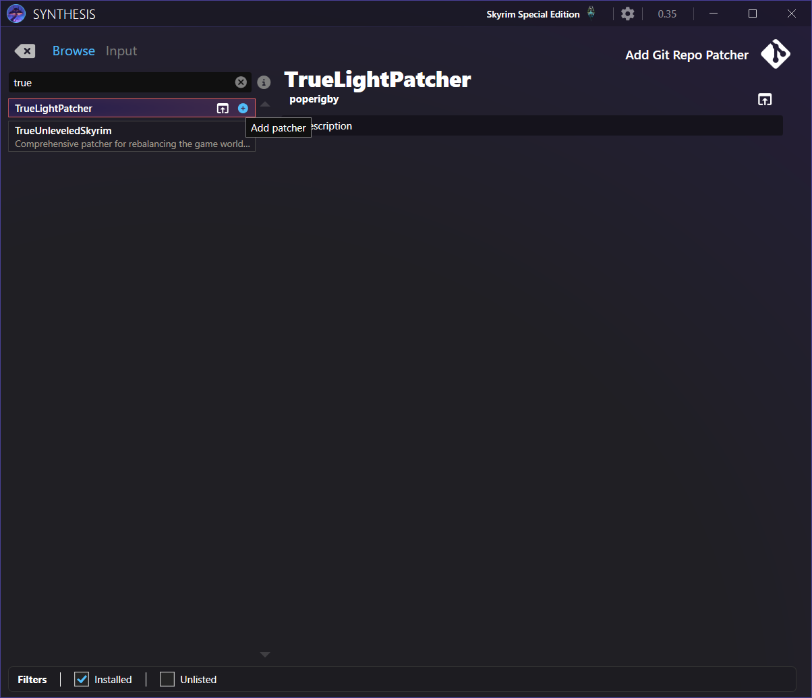
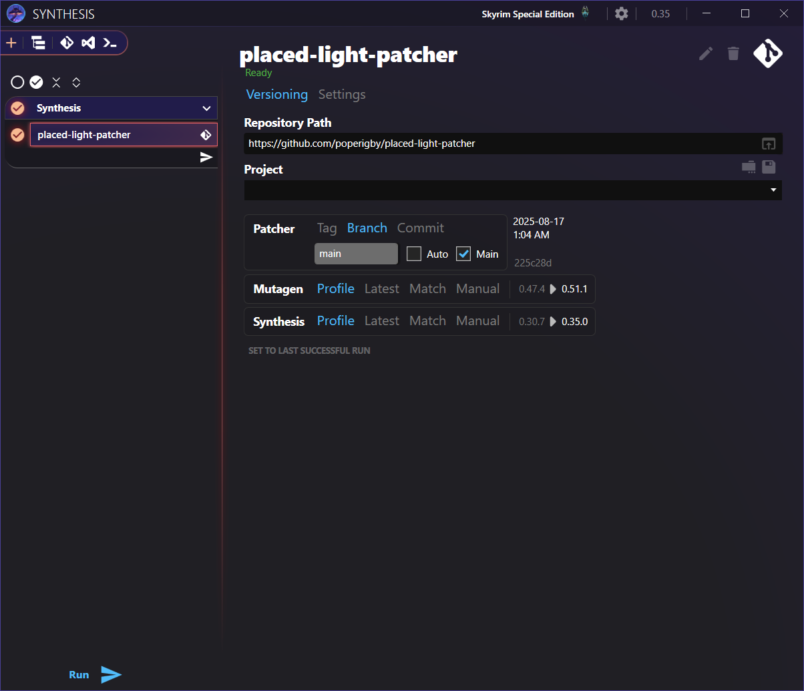

---
tags:
    - community shaders
    - fomod
    - light
    - nexus
    - synthesis
    - visual and graphics
---

# True Light

```project_info
homepage: https://www.nexusmods.com/skyrimspecialedition/mods/135488
about: An extensive, modern lighting mod using po3's powerful Light Placer and Community Shaders Inverse Square Lighting feature.
requirements:
    - Community Shaders
    - CS Light
    - Inverse Square Lighting - Community Shaders
    - Light Limit Fix - Community Shaders
    - Light Placer
    - powerofthree's Tweaks
    - Synthesis
downloads:
    - True Light
```

## FOMOD settings

!!! warning "Important"

    After installing or changing configuration:

    * run [Synthesis](#synthesis-patching)
    * check in *MO2*'s ``Plugin`` tag that the new ``.esp`` are enabled

```fomod_settings
pages:
    - name: Ambient Lighting
      sections:
        - name: Ambient Lighting
          default:
            value: Fixed Vanilla
            notes: Personal templates that I use. Just fixed up vanilla, brighter dungeons and interiors and still balanced.
          selected: Bright
    - name: Add-Ons and Patches
      sections:
        - name: Add-Ons
          options:
            - name: True Light - Exteriors
              default: No
            - name: Nature of the Wild Lands - Tree Lanterns
              default: No
            - name: Dwemer Swap BOS
              default: No
              selected:
                value: Yes
                notes: This Base Object Swapper INI file replaces Dwemer light sources with their 'on' variants.
            - name: FX Glow Remover BOS
              default: No
              selected:
                value: Yes
                notes: This Base Object Swapper INI file removes all fake Glow FX effects.
        - name: Patches
          options:
            - name: Nature of the Wild Lands
              default: No
            - name: Blowing in the Wind Lite
              default: No
            - name: Lumo - Placed Light Exteriors
              default: No
            - name: Window Shadows Ultimate
              default: No
            - name: Alternate Perspective
              default: No
            - name: Alternate Perspective Voiced
              default: No
```

## Synthesis Patching

* start *Synthesis* from *MO2*
* add the ``TrueLightPatcher`` recipe
* the recipe will appear as ``placed-light-patcher``
* run *Synthesis*




