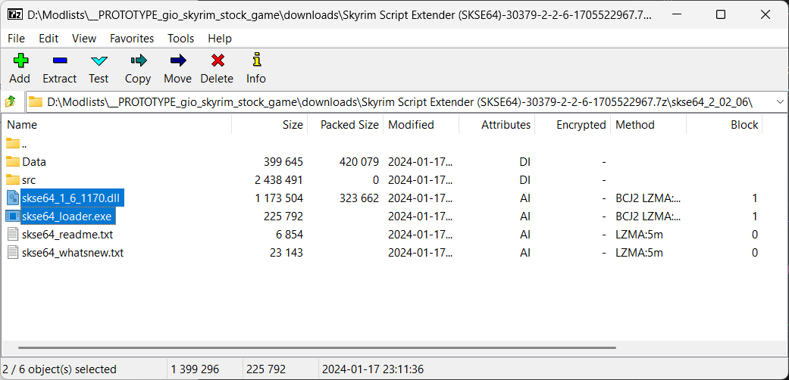

# Skyrim Script Extender (SKSE64)

## References

* [Setting up Stock Game for Skyrim SE - by Althro](https://github.com/LivelyDismay/Learn-To-Mod/blob/main/lessons/Setting%20up%20Stock%20Game%20for%20Skyrim%20SE.md#skse)
* [Skyrim Initial Setup (SSE and AE)](https://www.nexusmods.com/skyrimspecialedition/articles/6528)

## Download

Download the latest `skse` package for your *Skyrim version* from [nexus](https://www.nexusmods.com/skyrimspecialedition/mods/30379) with *MO2*.

## Install scripts

> We are installing the `Scripts` from *skse* as a module for easier update in the future.

In *Mod Organizer 2*:

* double-click the *skse* archive in the *Downloads* tab to install
* you will be informed that `The content of <data> does not look valid.`
* if the tutorial pops up, feel free to read through this if this is your first time or just exit by clicking the `Exit Tutorial` box

* expand the `skse64_x_x_x` item and right-click the `Data` folder
* select the `Set as <data> directory` menu

* after selecting the `Set as <data> directory` menu, the `Content` should look like bellow
* the dialog should show `The content of <data> looks valid.`
* click the `OK` button

## Install binaries

> There is only one `.exe` and one `.dll`, so it is OK to install them by hand

* the `.exe` and the `.dll` must be copied by hand in the `game_root` folder
* double-click the *skse* archive to open it with your *archive manager* (for example, [7-zip](https://www.7-zip.org/))
* select the `.exe` and the `.dll`
* drag-and-drop in the `game_root` folder

## Updating

If you need to update the *skse* in the future:

* uninstall the mod with the scripts
* install the new scripts as a mod
* overwrite the old binaries with the new ones