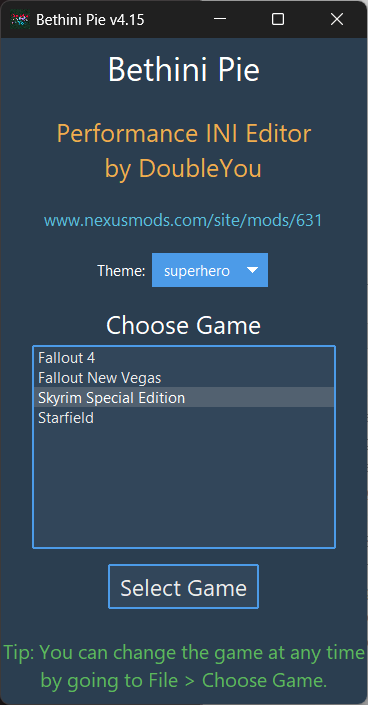
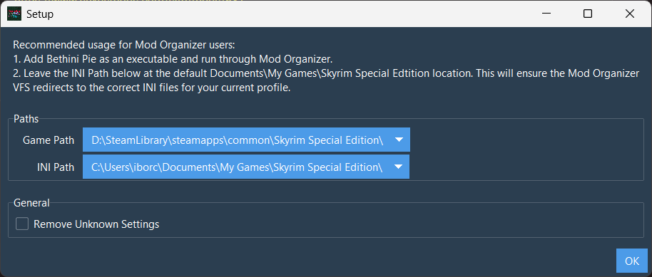

---
tags:
    - tools
---

# Bethini Pie

```project_info
homepage: https://www.nexusmods.com/site/mods/631
about: Universal tool to make editing INI configuration files simple via a graphical user interface
```

## Install

* click the `Manual download` and save the archive in the `downloads` folder
* check the download link and extract the `fileID` from the `file_id` http request
    * download URL: `https://www.nexusmods.com/site/mods/631?tab=files&file_id=5118`
    * `modID`: `631`
    * `fileID`: `5118`
* manually create the `.meta` file with a content similar to that bellow

    ```ini
    [General]
    installed=true
    gameName=site
    modID=631
    fileID=5118
    removed=true
    ```

* extract the `Bethini Pie` from the archive to `mo2\tools` folder
* create a launcher for `BethiniPie.exe`
* add the launcher to the toolbar

    ```mo2_launcher
    title: Bethini
    binary: "&lt;SOURCE_DIR&gt;\\mo2\\tools\\Bethini Pie\\Bethini.exe"
    start_in: ""
    arguments: ""
    force_load_libraries: true
    app_icon: true
    ```

## Setup

* launch *Bethini* from *MO2*
* select `Skyrim Special Edition` and click `Select Game`

    

* leave paths to their defaults and click `OK`

    
