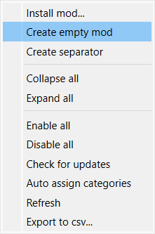
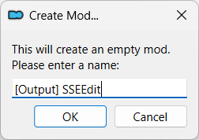
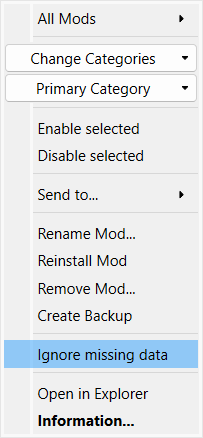

---
tags:
    - tools
    - xedit
    - sseedit
---

# SSEEdit

!!! note
    *SSEEdit* is the *Skyrim SE* version of [xEdit](https://github.com/TES5Edit/TES5Edit).

```project_info
homepage: https://www.nexusmods.com/skyrimspecialedition/mods/164
urls:
    - "[xEdit](https://github.com/TES5Edit/TES5Edit)"
    - "[Tome of xEdit](https://tes5edit.github.io/docs/)"
    - "[Althro's Dev Tools (ADT)](https://github.com/Styyx1/ADT)"
    - "[Skyrim Modding Essentials - A Wabbajack List](https://www.nexusmods.com/skyrimspecialedition/mods/71689)"
about: "Skyrim: Special Edition version of xEdit"
requirements:
    - "[7-Zip](https://www.7-zip.org/)"
downloads:
    - SSEEdit 4.1.5f **(manual download)**
```

## Install

* right-click and select `Query Info`
* right-click and select `Open File`
* copy the content to the `tools` folder
* rename the folder to `tools\SSEEdit`
* create a launcher

## [Output] SSEEdit

Create the `[Output] SSEEdit` mod to store the output generated by running `SSEEdit`:

* in *MO2*, right click in the area at the bottom, bellow the `Override` mod:
* select `Create empty mod` in the popup menu

    

* name the mod as `[Output] SSEEdit`

    

* right click the new mod and select `Ignore missing data`

    

* enable the mod and move it an `[Output]` group that stays at the bottom of your *MO2*

## SSEEdit launcher

```mo2_launcher
title: SSEEdit
binary: "&lt;SOURCE_DIR&gt;\\mo2\\tools\\SSEEdit\\SSEEdit.exe"
start_in: "&lt;SOURCE_DIR&gt;\\mo2\\stock_game\\Data"
arguments: '-D:"&lt;SOURCE_DIR&gt;\\mo2\\stock_game\\Data" -IKnowWhatImDoing'
overwrite_mod: "[Output] SSEEdit"
force_load_libraries: true
```


