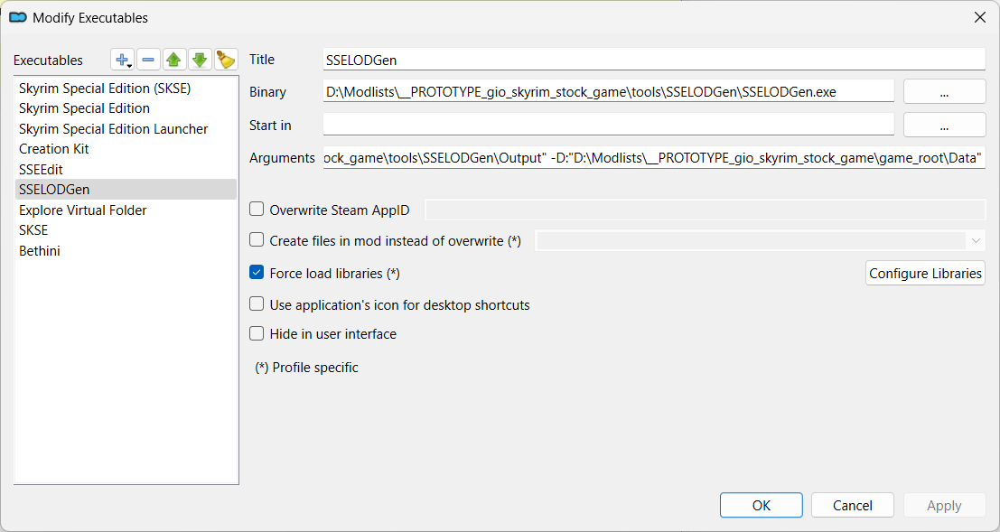

---
tags:
    - tools
    - sselodgen
---

# SSELODGen

```project_info
homepage: https://www.nexusmods.com/skyrimspecialedition/mods/6642
about: An almost one-click LOD generator for Skyrim Special Edition
downloads:
- SSELODGen 3.2.1 **(manual download)**
```

## Create .meta by hand

Right-click and select `Open Meta File` and use the download URL to determine the `modID`
and `fileID`.

```ini
[General]
installed=true
gameName=SkyrimSE
modID=6642
fileID=51884
removed=true
```

## Install

* make `mo2\tools\SSELODGen` folder
* right-click and select `Open File`
* copy the contents to the `mo2\tools\SSELODGen` folder
* create a launcher

## SSELODGen launcher

```mo2_launcher
title: SSELODGen
binary: "&lt;SOURCE_DIR&gt;\\mo2\\tools\\SSELODGen\\SSELODGen.exe"
arguments: '-sse -O:"&lt;SOURCE_DIR&gt;\\mo2\\tools\\SSELODGen\Output" -D:"&lt;SOURCE_DIR&gt;\\mo2\\stock_game\\Data"'
force_load_libraries: true
```


