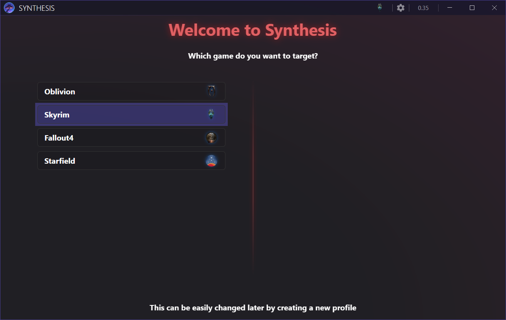
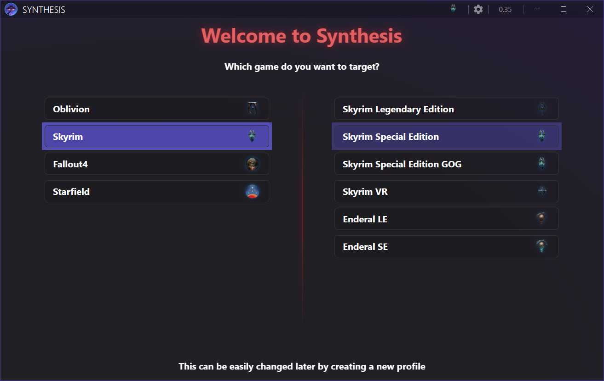
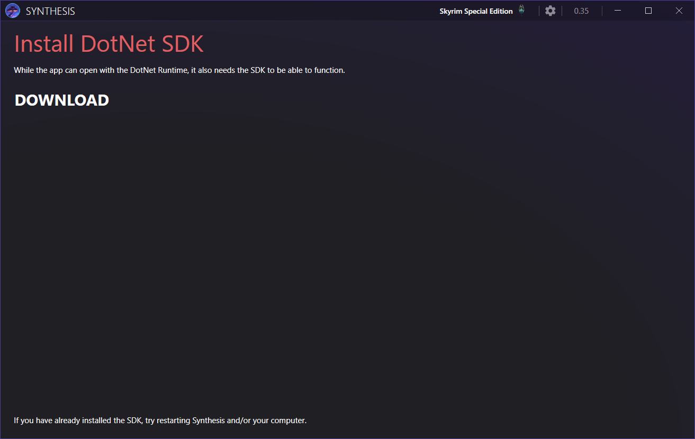
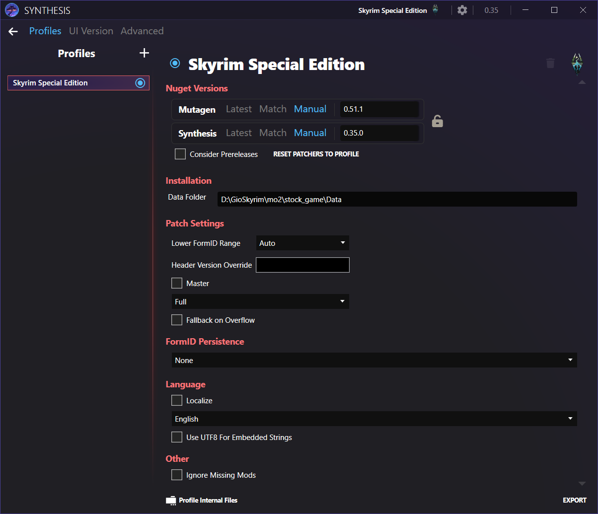
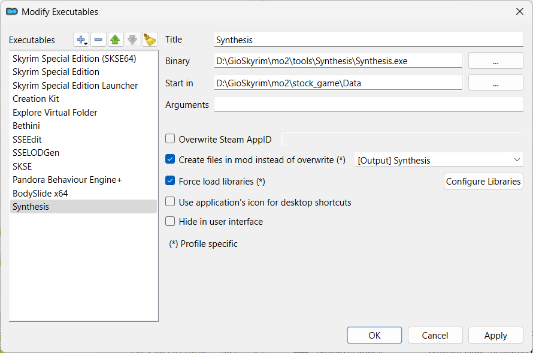
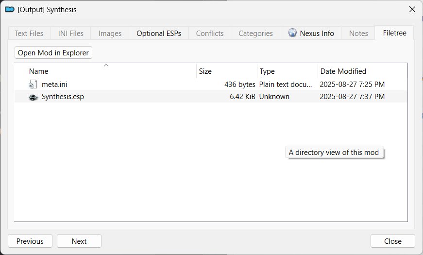

---
tags:
    - direct download
    - nexus
    - tools
    - synthesis
---

# Synthesis

```project_info
homepage: https://github.com/Mutagen-Modding/Synthesis
about: Framework and GUI to empower people to create mods via code instead of by hand. Users can run large numbers of these code-based mods and funnel their results into one or more files.
requirements:
downloads:
```

## .meta file

```ini
[General]
removed=false
directURL=https://github.com/Mutagen-Modding/Synthesis/releases/download/0.35.0/Synthesis.zip
```

## Install

* download and install ``NET SDK``
* create a ``mo2\tools\Synthesis`` folder
* copy the content of the downloaded archive to this file
* create ``[Output] Synthesis`` empty mod to store outputs from *Synthesis*
* run the game and set the game data path to the ``stock_game``
    * select the *Skyrim Special Edition* in the top-right
    * edit the ``Data Folder`` field
* create a launcher









## Launcher

```mo2_launcher
title: Synthesis
binary: "&lt;SOURCE_DIR&gt;\\mo2\\tools\\Synthesis\\Synthesis.exe"
start_in: "&lt;SOURCE_DIR&gt;\\stock_game\\Data"
overwrite_mod: "[Output] Synthesis"
force_load_libraries: true
```



## Usage

* launch *Synthesis* from *MO2*
* add your recipes
* click the ``Run`` button on the left-bottom
* the output will be stored on the ``[Output] Synthesis\Synthesis.esp``


